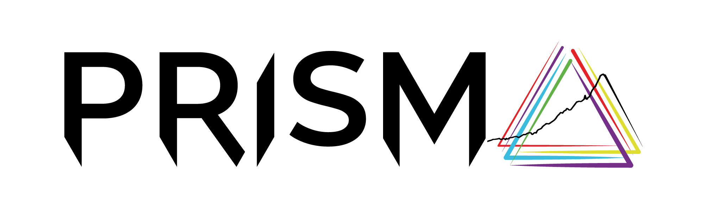

# Common definitions for model comparison projects

## Overview

This repository holds definitions and mappings for model-comparison projects using the IAMC data format.
The aim is to provide a central location to facilitate reuse of definitions and mappings across projects.
Read more about the [IAMC data format](https://docs.ece.iiasa.ac.at/iamc.html).

This project uses the Python package [nomenclature-iamc](https://nomenclature-iamc.readthedocs.io)
for management of codelists and validation of scenario data in the IAMC data format.

> [!IMPORTANT]  
> The list of variables defined in this repository are those that **may** be used in
> model comparison projects and **can** be reported by modeling teams, but it is **not required**
> that all variables are included when submitting scenario data.
> You can filter by the "tier" attribute for an indication of the priority of specific variables.

> [!TIP]
> For *users not comfortable working with GitHub repositories and yaml files*,
> the definitions for this project are available for download as an xlsx spreadsheet
> at https://files.ece.iiasa.ac.at/common-definitions/common-definitions-template.xlsx.

> [!NOTE]
> You can generate the project region and variable template xlsx spreadsheet yourself!
> 1. Clone/download this repository
> 2. Install the Pyhon package **nomenclature** (`pip install nomenclature-iamc`)
> 3. Run `$ nomenclature export-definitions . definitions.xlsx`

## Codelists and mappings

The folder [definitions](definitions) contains the "codelists", i.e., list of allowed variables and regions, for use in
the validation workflow. In the IAMC community, the word "variable template" is also used to refer to the codelists for
variables.

The folder [mappings](mappings) contains models-specific processing and automated aggregation of regions from
"native model regions" (as reported by a model) to "common regions" used for comparison and analysis of results.

## Model registration

This is the step-by-step guide to registering your model:

1. Fork this repository
2. Follow the instructions from the nomenclature documentation here: <https://nomenclature-iamc.readthedocs.io/en/stable/user_guide/model-registration.html>. 
Please make sure to follow the instructions completely, both the _Model mapping_ and the _Region definitions_ part. You'll have to end up with two files.
3. Open a pull request into this repository. Make sure that the tests pass and
   correct any potential issues.
4. Set [@danielhuppmann](https://github.com/danielhuppmann) and [@phackstock](https://github.com/phackstock)
   as reviewers (or mention them in the pull request text).
5. Once everything is in order we will merge your pull request and your model will be registered.

## Mapping of variables to legacy projects

The variable codelists contain attributes to indicate that variables were renamed compared to earlier (legacy) projects.
These attributes use lower-case spelling of the projects, and they can be used to create a renaming-mapping
when transferring scenario data to the **common-definitions** variable list.

There are also project-specific rename-mapping files in the [legacy](legacy) folder for cases where the variable
attributes could not be used easily.

For transferring the **SHAPE** project, use the variable attributes `shape` and `navigate`. 

## IAMC common regions (R5, R9, R10) geojsons

The geojson files for the common regions (R5, R9, R10) are available 
in the [scse-geojson](https://github.com/iiasa/scse-geojson) repository.

## Funding acknowledgement

This repository was started as part of the <a href="https://www.net0prisma.eu">PRISMA project</a>
with funding from the European Union’s Horizon Europe programme
under grant agreement No. 101081604 (PRISMA).
